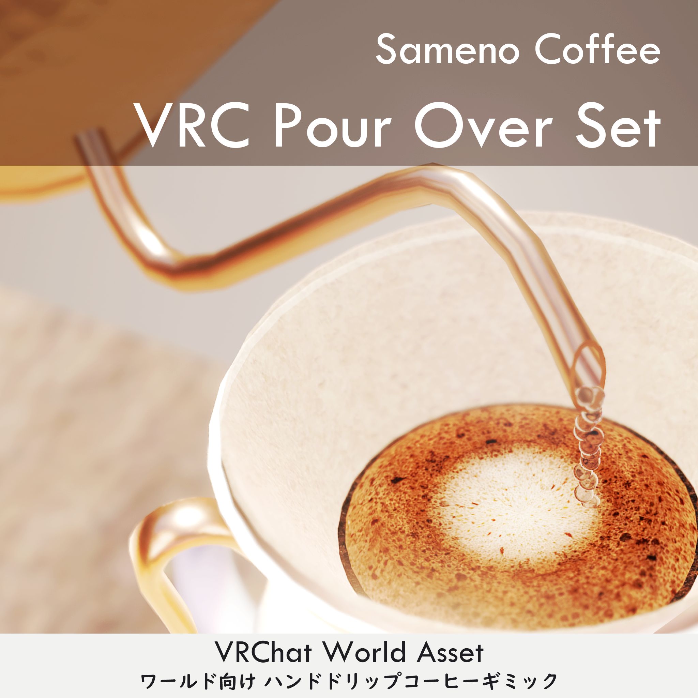
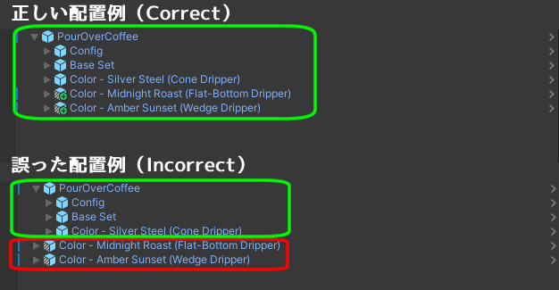
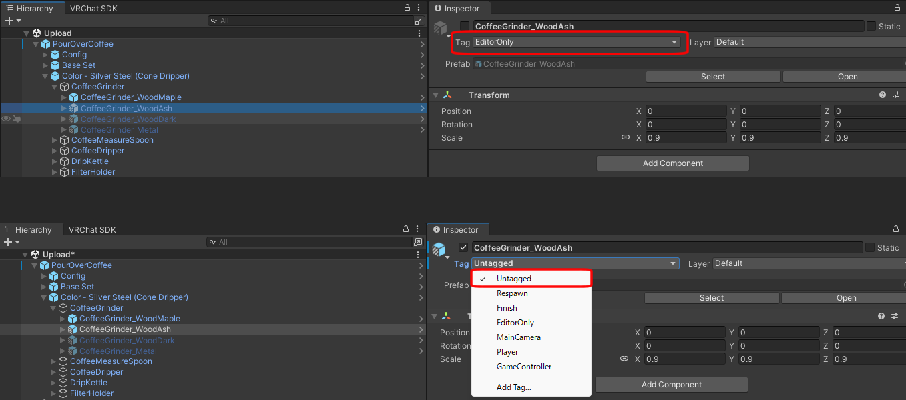

# VRC Pour Over Set 説明書（Manual）

© 2026 Sameno Works(sumisame) All rights reserved.

[Booth Link](https://sameno.booth.pm/items/8447294)

------

更新履歴 / Release

2026/07/24: Manual v1.0.0 Released. 

# 事前準備

本パッケージを使用する際は、Unity 2022.3.22f1のプロジェクトをご用意ください。

Unity 2019とは互換性がありませんのでご注意ください。

本商品はWorld Phys Boneを使用しています。VRCSDKは ver3.10.0以降を必ず使用してください。

本商品はUdonSharp(U#)を使用しています。VCC(VRChat Creator Companion)のWorlds U#でプリインストールされている最新バージョンの U# を使用してください。

VCC経由でインストールされるU#以外のバージョンは動作サポート対象外とさせていただきます。  

本商品はシェーダーにliltoonを使用しています。 

本商品をインストールする前に、以下URLまたはVCCより最新の「liltoon」をプロジェクトにインポートしてください。

liltoon

https://lilxyzw.booth.pm/items/3087170

# クイックスタート

## 1. 導入

### 手順 (1)
Unitypackageファイルをインポート後、「Assets\SamenoLab\VRCPourOverCoffee」にある「DripSet - Quick Start」から、「PourOverCoffee」をSceneに配置します。

※初回インポート時に、「TMP Importer」という画面が出ることがあります。この画面が出た場合は、「Import TMP Essentials」を押してください。（画面が出ない場合は特に操作不要です）

### 手順(2)
お好みで「Assets\SamenoLab\VRCPourOverCoffee\DripSet - Quick Start」にある「Color - xxx」フォルダから、
お好みのスキンのPrefabを、Sceneに配置します。

以上でセットアップは完了です。

**⚠️注意事項**
複数のPrefabを設置する場合は、「**改変の手引き**」の注意事項をご確認ください。

### 2. 改変の手引き
デフォルトで「PourOverCoffee」に入っている「Color - Silver Steel (Cone Dripper)」のPrefab内には、非アクティブな状態で全てのカラーバリエーション、すべての形状のドリッパーが配置されています。

このうち、非アクティブなオブジェクトは、デフォルトでは「Editor Only」（シーン上では見えるもののワールドにアップロードされない）状態になっています。
非アクティブなオブジェクトをワールドで使用したい場合は、「Editor Only」から「UnTagged」に変更してアップロードしてください。

**⚠️注意事項**
本アセットは、ルートオブジェクト（最上位オブジェクト `PourOverCoffee`）に、ドリップギミック全体を管理するマネージャー用スクリプトをアタッチしています。
またコーヒー豆の情報を保存するオブジェクトとして、`Config`という名称のオブジェクトが存在します。
`PourOverCoffee` および `Config`は、**シーン内に必ず1つだけ存在するように配置してください**。

各種スキンPrefabは複数配置して組み合わせることができますが、本アセットに含まれる「Base Set」内部のオブジェクトは、`PourOverCoffee`の子オブジェクトとして配置する必要があります。
複製後のオブジェクトが`PourOverCoffee`の配下に配置されていることをご確認ください。

`PourOverCoffee`の外に配置された「Base Set」のオブジェクトは、システムから正しく認識されず、設定の反映などが正常に動作しない場合があります。

**重要**
- `PourOverCoffee`はシーン内に1つだけ配置します。
- スキンPrefabは複数配置できます。
- 「Config」、「Base Set」のPrefabを`PourOverCoffee`の子オブジェクトにしてください。
- `Config`はシステムが使用するオブジェクトです。通常は移動、削除を行わないでください。

### 3. オブジェクトの複製

「Base Set」または「Color - xxx」のオブジェクトは「ctrl+D」で複製可能です。

複製後のオブジェクトは、特に設定不要でそのまま使用できます。

# ギミックの仕様と設定
## グラインダー
### ・基本機能
グラインダー本体に豆を入れて、ハンドルを回すと豆を挽くことができます。
グラインダー下部にある透明な容器（ジャー）に豆や粉が入ります。
ジャーを使って豆を計量し、グラインダーに投入して挽く使い方が可能です。
ハンドルは、本体をUSEすることで着脱できます。
グラインダーには最大40gの豆を入れることができます。

### ・高度な機能
粒度：
V1.0時点では、グラインダーの粒度は「中挽き (Medium)」で固定となっています。
粒度はUnity Inspector上の「基本設定 - デフォルト粒度」より設定できます。
※将来対応として、グラインダーの粒度変更機能のアップデートを予定しています。

グラインド量：
グラインダーのハンドルを回した際に1回転あたりに引くことができる粉量をUnity Inspector上で設定可能です。
グラインド量が大きいほど、早く豆を挽き終わります。
初期設定では現実のグラインダーに近いグラインド量となっていますが、イベント利用等で時間短縮が必要な場合は少し大きめの値をお試しください。

音量：
グラインダーの音量もInspector上で調整可能です。初期値で最大音量（x1）となります。
音が大きすぎる場合はこの値を小さめに設定してください。

## メジャースプーン
### ・基本機能
コーヒー粉や、コーヒー豆をすくって移し替えるスプーンです。USEするとスプーンの中身を排出します。
スプーン1杯の内容量は「15g」です。

### ・高度な機能
コーヒー豆の場合のみ、スプーンの傾きに応じてUSE時に排出される豆の重量が変化します。
水平状態だと1gずつ、傾けるほど排出される量が増加します。
上下逆さにした状態だと、すべての豆を排出します。

## ケトル
### ・基本機能
傾けるとお湯が出ます。ケトルの角度に応じて湯量を細やかに調整可能です。
現実のドリップケトルに近い感覚でお湯を注ぐことができます。
デスクトップ向けの補助機能として、USEすると固定量のお湯が出力されます。
VR操作でも、一定の湯量をキープすることが難しい場合はUSEでの注湯をお試しください。

### ・高度な機能
ケトルの持ち手の下にお湯の温度が表示されています。
温度表示部にインタラクトすると、水温調整ボタン（＋ボタン、－ボタン）が表示されます。
水温は、60℃～100℃の間で設定可能です。
デフォルトの水温は、Unity Inspector上の「基本設定 - Water Temperature」より設定できます（デフォルト値：90℃）。

## ドリッパー
**⚠️注意事項**
ドリッパーにお湯を入れるプレイヤーは1人を想定しています。
ドリップ中は、ドリップを開始したプレイヤー以外はお湯を入れることができません。
ドリップの判定は、75秒以上お湯を注がないとタイムアウトとなり、ドリップ終了判定となります。

### ・基本機能
ドリッパーは、マグカップまたはガラスサーバーに乗せて使用します。
フィルターとコーヒー粉をセットすると、お湯を注ぐことができます。
ドリッパーの形状は3種類あります。各形状にあったペーパーフィルターを近づけると、ドリッパーにセットできます。
ドリッパーの操作方法はすべて同じです。お好みのデザインのドリッパーでお楽しみください。

- 円錐ドリッパー（Cone）
- 台形ドリッパー（Wedge）
- 平底ドリッパー（Flat）

### ・高度な機能
本ギミックのドリッパーは、内部情報としてドリップ時の情報（温度、粉量、水量、ドリップ時間）を取得しています。
ドリップ開始の判定は、ケトルから最初のお湯が注がれた瞬間です。
ドリップ終了の判定は、ドリッパーをピックアップした瞬間となります。
お湯の温度情報は、一番最初に注いだお湯の温度が記録されます。
ドリップ時間と水量は、お湯を入れるたびに記録されます（最大7回分のログを取得します）。

## ペーパーフィルター
### ・基本機能
円錐ドリッパー、台形ドリッパー、平面ドリッパー向けのペーパーフィルターがあります。
円錐ドリッパーと台形ドリッパーは、フィルターの端を折り曲げて使用します。USEすると折り曲げることができます。
ドリッパーにセットした後、お湯を注ぐことでフィルターを湿らせる（リンスする）ことができます。

### ・高度な機能
フィルターホルダーから取り出せるフィルターの枚数は最大5枚となります。
リセットボタンを押すと、取り出されたフィルターを回収します。
フィルターホルダーから取り出せるフィルターの枚数を変更する場合は以下の手順をお試しください。

- FilterHolder_XXXのInspectorより、VRC Object PoolのPool数を任意の数に変更
- FilterHolder_XXX直下のPaperFilter_xxxオブジェクトを任意の数だけ複製
- FilterHolder_XXXのVRC Object Poolスロットに新規複製したPaperFilter_xxxオブジェクトをセット

## ガラスサーバー
### ・基本機能
ガラスサーバーの上にドリッパーを乗せてドリップすると、抽出されたコーヒーをサーブすることができます。
サーブされたコーヒーは、USEすることで排出されます。
コーヒーはカップやマグカップに注ぐことができます。

## デジタルスケール
**⚠️注意事項**
デジタルスケールの計測可能範囲は、利便性を優先して見た目より少し広く判定を取得しています。
デジタルスケールを複製して設置する際は、十分に距離を離して設置してください（0.3 m程度目安）。
近づきすぎると正しく重量測定ができなくなる可能性があります。

### ・基本機能
デジタルスケールは、ドリップの補助情報として「重量計」「タイマー」「抽出比率」を表示します。
デジタルスケールを使用しなくてもドリップは可能です。

### ・バリスタ名
デジタルスケールを使用しているプレイヤー名が表示されます。
もし自分以外のプレイヤー名が表示されている場合は、リセットボタンを押すことで手動でプレイヤー名をセットできます。

### ・重量計
デジタルスケールの上にあるオブジェクトの重量を表示します。
リセットボタンを押すと、重量をゼロリセットします。
デジタルスケールに反応するオブジェクトは、「ドリッパー」、「ガラスサーバー」、「マグカップ」、「グラインダー」の4種類です。それ以外のオブジェクトは反応しません。
重量計が測定できるオブジェクト数は最大で10個までとなります。デジタルスケール周辺に物を置きすぎないようにご注意ください。

### ・タイマー
ドリップが開始されると、自動的にタイマーがスタートします。
タイマー開始の判定は、ドリッパーにお湯が注がれた瞬間、タイマー停止の判定は、ドリッパーをピックアップした瞬間となります。
タイマーの表示はリセットボタンを押すと初期化されます。

### ・Brew Ratio（抽出比率）※上級者向け
本項目は、バリスタ名に表示されているプレイヤーのみローカル表示されます。
ドリッパーに入れたコーヒーの粉の重量を1としたときの、お湯の重量の比率がリアルタイムで出力されます。
コーヒーの抽出比率は1：15前後が一般的です。
この場合、粉の重量の15倍のお湯を入れる意となります。

## コーヒーカップ
### ・基本機能
ガラスサーバーにサーブしたコーヒーをカップに注ぐと、ドリップしたコーヒーを入れて飲むことができます。
カップはソーサーに触れると追従するようになります。
カップとソーサーが分かれているときに、ソーサーをUSEするとカップがソーサーの位置に戻ってきます。
カップにコーヒーが入った状態で、空のコーヒーカードを近づけると、淹れられたコーヒーの情報を見ることができます。

## マグカップ
### ・基本機能
カップと同様に、ガラスサーバーにサーブしたコーヒーをマグカップに注ぐと飲むことができます。
マグカップの場合は、ドリッパーを直接マグカップに乗せてドリップすることができます。
マグカップにコーヒーが入った状態で、空のコーヒーカードを近づけると、淹れられたコーヒーの情報を見ることができます。

## キャニスター（豆、粉）
### ・基本機能
黒色のキャニスターにはコーヒー豆が、銀色のキャニスターにはコーヒー粉が入っています。
コーヒーカードをキャニスターに近づけると、入っているコーヒーの情報と、推奨レシピがカードに印字されます。

### ・高度な機能
キャニスターに入れるコーヒー豆情報の登録方法は以下の通りです。
（マニュアルは現在準備中です。）

## コーヒーカード
### ・基本機能
空のコーヒーカードは、コーヒー情報をスキャンして表示する機能があります。
カップに淹れられたコーヒーと、豆や粉が入ったキャニスターにカードを近づけると、そのコーヒー豆の情報をカードに印字します。
裏面には、豆・粉の場合は推奨レシピが、カップに入ったコーヒーの場合は抽出ログが表示されます。

上記のスキャンモード以外に、ワールドアップロード時にコーヒー情報を固定表示するモードがあります。
キャニスターのそばに固定表示モードのカードを置くことで、その豆の情報を来訪者に伝えることができます。

### ・高度な機能
固定表示モードで印字するコーヒー豆情報の登録方法は以下の通りです。
（マニュアルは現在準備中です。）

# お問い合わせ

不具合やご不明点に関するお問い合わせはBoothメッセージまでご連絡ください。  

https://sameno.booth.pm/

本商品を使用した作品のシェアは、ハッシュタグ「#さめのワークス」をご活用ください！  

